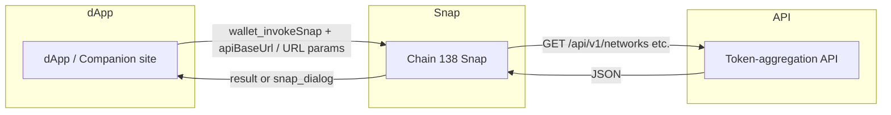

# Chain 138 Snap — Features and RPC methods

This document lists every function and feature of the Snap, with parameters and response shapes. The Snap supports **both** blockchains: **Chain 138** (DeFi Oracle Meta Mainnet) and **ALL Mainnet** (651940).

---

## Blockchains supported

| Chain           | Chain ID | Name                     | Use in Snap                                           |
| --------------- | -------- | ------------------------ | ----------------------------------------------------- |
| **Chain 138**   | 138      | DeFi Oracle Meta Mainnet | Primary; networks, config, market, swap, bridge       |
| **ALL Mainnet** | 651940   | ALL Mainnet              | Supported in networks, token list, optional `chainId` |

All methods that accept an optional `chainId` default to **138** when omitted.

---

## Feature overview (visual)

```
┌─────────────────────────────────────────────────────────────────────────┐
│                     Chain 138 Snap (npm:chain138-snap)                  │
├─────────────────────────────────────────────────────────────────────────┤
│  Networks & config     │  get_networks, get_chain138_config,            │
│  (Chain 138 + ALL)     │  get_chain138_market_chains                    │
├─────────────────────────────────────────────────────────────────────────┤
│  Token list            │  get_token_list, get_token_list_url            │
│  (optional chainId)     │  (chainId: 138 or 651940)                     │
├─────────────────────────────────────────────────────────────────────────┤
│  Market data           │  get_market_summary, show_market_data          │
│  (USD prices)          │  (dialog: token symbols + prices)              │
├─────────────────────────────────────────────────────────────────────────┤
│  Bridge routes         │  get_bridge_routes, show_bridge_routes          │
│  (CCIP + Trustless)    │  (dialog: CCIP WETH9/WETH10 + Trustless Lockbox)│
├─────────────────────────────────────────────────────────────────────────┤
│  Swap quote            │  get_swap_quote, show_swap_quote               │
│  (Chain 138)           │  (tokenIn, tokenOut, amountIn → amountOut)      │
├─────────────────────────────────────────────────────────────────────────┤
│  Oracles & dynamic     │  get_oracles, show_dynamic_info                │
│  (API config)          │  (dialog: networks + token list URL)          │
├─────────────────────────────────────────────────────────────────────────┤
│  Test                  │  hello (returns greeting)                      │
└─────────────────────────────────────────────────────────────────────────┘
```

---

## RPC method matrix

| Method                       | Chain 138 | ALL (651940) | Requires apiBaseUrl / URL param          | Shows dialog (UI)  |
| ---------------------------- | --------- | ------------ | ---------------------------------------- | ------------------ |
| `hello`                      | —         | —            | No                                       | Yes (confirmation) |
| `get_networks`               | ✅        | ✅           | apiBaseUrl or networksUrl                | No                 |
| `get_chain138_config`        | ✅        | —            | apiBaseUrl or networksUrl                | No                 |
| `get_chain138_market_chains` | ✅        | —            | apiBaseUrl                               | No                 |
| `get_token_list`             | ✅        | ✅           | apiBaseUrl or tokenListUrl               | No                 |
| `get_token_list_url`         | ✅        | ✅           | apiBaseUrl or tokenListUrl               | No                 |
| `get_oracles`                | ✅        | —            | apiBaseUrl                               | No                 |
| `show_dynamic_info`          | ✅        | ✅           | apiBaseUrl or networksUrl/tokenListUrl   | **Yes**            |
| `get_market_summary`         | ✅        | ✅           | apiBaseUrl                               | No                 |
| `show_market_data`           | ✅        | ✅           | apiBaseUrl                               | **Yes**            |
| `get_bridge_routes`          | ✅        | —            | apiBaseUrl or bridgeListUrl              | No                 |
| `show_bridge_routes`         | ✅        | —            | apiBaseUrl or bridgeListUrl              | **Yes**            |
| `get_swap_quote`             | ✅        | —            | apiBaseUrl + tokenIn, tokenOut, amountIn | No                 |
| `show_swap_quote`            | ✅        | —            | apiBaseUrl + tokenIn, tokenOut, amountIn | **Yes**            |

---

## Method reference by category

### Test

| Method  | Params | Response                       | UI                  |
| ------- | ------ | ------------------------------ | ------------------- |
| `hello` | —      | `"Hello from Chain 138 Snap!"` | Confirmation dialog |

---

### Networks and chain config

| Method                       | Params                        | Response shape                                                                             |
| ---------------------------- | ----------------------------- | ------------------------------------------------------------------------------------------ |
| `get_networks`               | `apiBaseUrl` or `networksUrl` | `{ version?, networks: EIP-3085[] }`                                                       |
| `get_chain138_config`        | `apiBaseUrl` or `networksUrl` | Chain 138 params (chainId, chainName, rpcUrls, nativeCurrency, blockExplorerUrls, oracles) |
| `get_chain138_market_chains` | `apiBaseUrl`                  | `[{ chainId, name, nativeToken, rpcUrl, explorerUrl }]`                                    |

**Visual (dialog):** None for get\_\*; use `show_dynamic_info` for an in-Snap dialog with networks and token list URL.

---

### Token list

| Method               | Params                                                             | Response shape                                              |
| -------------------- | ------------------------------------------------------------------ | ----------------------------------------------------------- |
| `get_token_list`     | `apiBaseUrl` or `tokenListUrl`, optional `chainId` (138 \| 651940) | `{ tokens: [{ symbol, name, address, ... }] }` or API shape |
| `get_token_list_url` | Same                                                               | URL string or object with token list URL                    |

---

### Oracles and dynamic info

| Method              | Params                                         | Response / UI                                   |
| ------------------- | ---------------------------------------------- | ----------------------------------------------- |
| `get_oracles`       | `apiBaseUrl`                                   | Oracles config from API                         |
| `show_dynamic_info` | `apiBaseUrl` or `networksUrl` / `tokenListUrl` | **Dialog:** networks summary and token list URL |

---

### Market data (USD prices)

| Method               | Params                                         | Response shape                                                              | UI                                                                      |
| -------------------- | ---------------------------------------------- | --------------------------------------------------------------------------- | ----------------------------------------------------------------------- |
| `get_market_summary` | `apiBaseUrl`, optional `chainId` (default 138) | `{ tokens: [{ symbol, name, address, market?: { priceUsd, volume24h } }] }` | No                                                                      |
| `show_market_data`   | Same                                           | —                                                                           | **Dialog:** "Market data (Chain 138)" with token symbols and USD prices |

---

### Bridge routes (CCIP + Trustless)

| Method               | Params                          | Response shape                                                                                  | UI                                                                                        |
| -------------------- | ------------------------------- | ----------------------------------------------------------------------------------------------- | ----------------------------------------------------------------------------------------- |
| `get_bridge_routes`  | `apiBaseUrl` or `bridgeListUrl` | `{ routes: { weth9?, weth10?, trustless? }, chain138Bridges: { weth9?, weth10?, trustless? } }` | No                                                                                        |
| `show_bridge_routes` | Same                            | —                                                                                               | **Dialog:** CCIP (WETH9/WETH10) and Trustless (Lockbox on 138) routes to Ethereum Mainnet |

The API or `bridgeListUrl` JSON may include:

- **CCIP:** `routes.weth9`, `routes.weth10`, `chain138Bridges.weth9`, `chain138Bridges.weth10`.
- **Trustless:** `chain138Bridges.trustless` (Lockbox on Chain 138), optional `routes.trustless['Ethereum Mainnet (1)']` (Ethereum-side contract).

---

### Swap quote

| Method            | Params                                                                                         | Response shape                         | UI                               |
| ----------------- | ---------------------------------------------------------------------------------------------- | -------------------------------------- | -------------------------------- |
| `get_swap_quote`  | `apiBaseUrl`, `tokenIn`, `tokenOut`, `amountIn` (raw string), optional `chainId` (default 138) | `{ amountOut?, error?, poolAddress? }` | No                               |
| `show_swap_quote` | Same                                                                                           | —                                      | **Dialog:** In/Out amounts (raw) |

---

## Request flow (high level)



---

## Optional URL overrides

Instead of (or in addition to) `apiBaseUrl`, you can pass:

| Param           | Used by methods                           |
| --------------- | ----------------------------------------- |
| `networksUrl`   | `get_networks`, `get_chain138_config`     |
| `tokenListUrl`  | `get_token_list`, `get_token_list_url`    |
| `bridgeListUrl` | `get_bridge_routes`, `show_bridge_routes` |

---

## Screenshots and visuals (for maintainers)

To make the docs more visual, add screenshots under **`docs/images/`** and link them here and in the README. Suggested captures:

| Screenshot                 | Description                                                      |
| -------------------------- | ---------------------------------------------------------------- |
| `connect.png`              | Companion site Connect button and MetaMask install prompt        |
| `market-data-dialog.png`   | Snap dialog from `show_market_data` (Chain 138 tokens + prices)  |
| `bridge-routes-dialog.png` | Snap dialog from `show_bridge_routes` (CCIP + Trustless routes)  |
| `swap-quote-dialog.png`    | Snap dialog from `show_swap_quote`                               |
| `dynamic-info-dialog.png`  | Snap dialog from `show_dynamic_info` (networks + token list URL) |

After adding images, link them in this section and in [README.md](../README.md).
